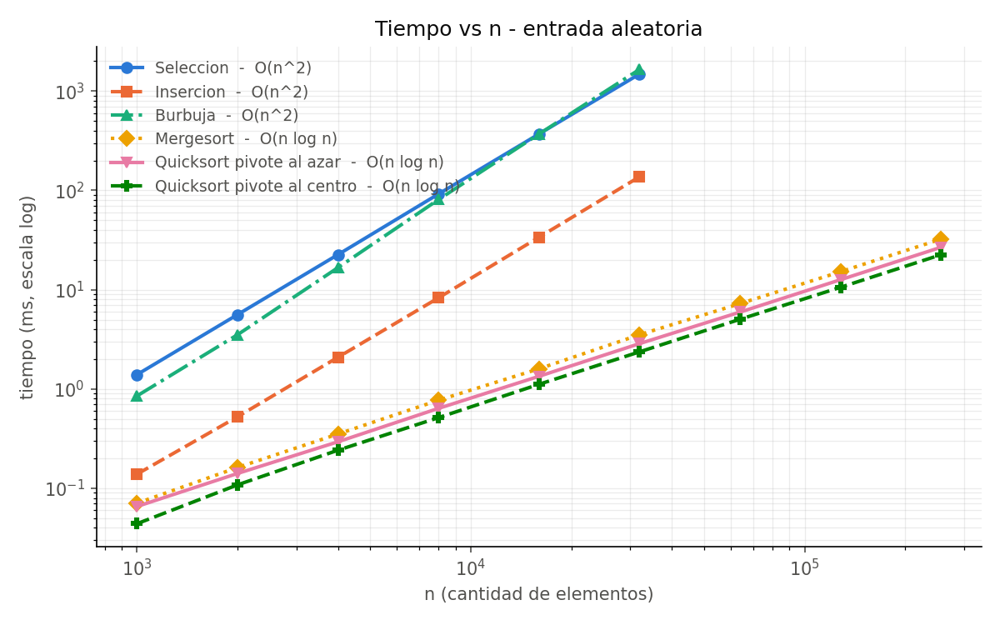
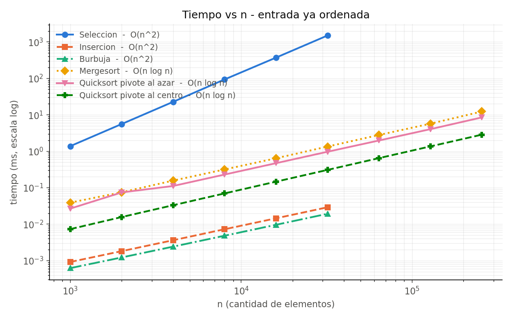

# Laboratorio 2 — Quicksort y comparación empírica de algoritmos de ordenamiento

## Objetivo

Medir los tiempos de ejecución reales de **Quicksort** con dos estrategias de elección de pivote —**al azar** (la del libro) y **al centro** del subarreglo— y compararlos contra **Mergesort** y contra un **algoritmo básico cuadrático** que cada estudiante elige.

Quicksort **ya viene programado** en el esqueleto: es el que se hizo en clases. Lo que tienes que implementar es el algoritmo básico que elijas y Mergesort, para poder completar la comparación.

Al terminar debes tener:

1. Tu algoritmo básico y tu Mergesort funcionando, junto a las dos variantes de Quicksort que ya vienen.
2. Dos **tablas de tiempos** (`times_random.csv` y `times_sorted.csv`) para varios valores de `n`.
3. Dos **gráficos** de tiempo vs `n` generados a partir de esas tablas.
4. Una respuesta a las preguntas de análisis del final.

Contenido del libro: **Cap. 2.7** (Algoritmos de Ordenación), Alg. 9 a 14.

## Estructura

```
lab2/
├── README.md
├── img/                      # gráficos de referencia
└── starter/sort/             # esqueleto con TODOs — acá trabajas
    ├── CMakeLists.txt
    ├── include/sort/sort.hpp
    ├── include/sort/utils.hpp
    ├── src/sort.cpp          # <-- lo que hay que completar
    ├── src/utils.cpp         # utilidades, ya entregado
    ├── tests/main.cpp        # banco de pruebas, ya entregado
    └── python/plot_times.py  # generador de gráficos, ya entregado
```

La configuración del entorno (g++, CMake, VSCode) está en [`../SETUP.md`](../SETUP.md).

## Alineación con el libro y con el repositorio del curso

Este laboratorio **no inventa una interfaz nueva**: reusa la del módulo `sort` del repositorio oficial [`eda_cpp`](https://github.com/jmsaavedrar/eda_cpp), y los algoritmos son los del libro, en el mismo orden y con los mismos nombres de parámetros.

### Algoritmos

| Algoritmo | Libro | Función en `sort.hpp` |
|---|---|---|
| Ordenación por Selección | §2.7.1, Alg. 9 | `selectionSort(A, n)` |
| Ordenación por Inserción | §2.7.2, Alg. 10 | `insertionSort(A, n)` |
| Burbuja | **no aparece en el libro** | `bubbleSort(A, n)` |
| Mezcla de sublistas | §2.7.3, Alg. 11 | `merge(A, i, j, k)` |
| MergeSort | §2.7.3, Alg. 12 | `mergeSort(A, i, j)` |
| División (split) | §2.7.4, Alg. 13 | `split_qs(A, i, j)` |
| QuickSort | §2.7.4, Alg. 14 | `quickSort(A, i, j)` |

Dos advertencias que se prestan a confusión:

- **`merge` recibe `(A, i, j, k)`, en ese orden.** El punto de corte `k` va **al final**, no al medio, porque así lo llama el Alg. 12. Las sublistas ordenadas son `A[i..k]` y `A[k+1..j]`.
- **El Quicksort del libro ya usa pivote aleatorio.** El Alg. 13 empieza con `p ← aleatorio(i, j)`. O sea, `quickSort` (pivote al azar) **es** la versión del libro; `quickSortMiddle` (pivote al centro) es la variante que agrega este laboratorio para poder comparar.

`bubbleSort` es el único algoritmo que **no** está en el libro. Se incluye solo como tercera opción del Paso 1, y está marcado como extra tanto en `sort.hpp` como en `sort.cpp`.

### Convenciones tomadas de `eda_cpp/sort`

| Elemento | `eda_cpp/sort` | Este laboratorio |
|---|---|---|
| Tipo de los arreglos | `float*` | igual |
| Namespace | `sort` | igual |
| Guardas de include | `SORT_SORT_HPP`, `SORT_UTILS_HPP` | igual |
| Módulo de utilidades | `include/sort/utils.hpp` + `src/utils.cpp` | copiado tal cual, más 3 funciones nuevas |
| `selectionSort` | implementado | **mismo código** |
| `split_qs` | Alg. 13 con pivote aleatorio | mismo algoritmo, con la posición del pivote como parámetro |
| Sobrecargas | `quickSort(A,i,j)` y `quickSort(A,n)` | igual, y se replica en `quickSortMiddle` |
| Semilla aleatoria | `std::srand(std::time(nullptr))` | igual |
| Creación de arreglos | `createRandomArray`, `createRandomIntArray` | igual |

Las tres funciones agregadas a `utils` (`createSortedArray`, `copyArray`, `isSorted`) están al final del archivo, bajo un comentario que las separa de las originales.

### Diferencias deliberadas

Son tres, y todas están comentadas en el código:

1. **`tests/main.cpp` en vez de `tests/test.cpp`.** El módulo oficial `sort` usa `test.cpp`, pero `misc` usa `main.cpp`, y `main.cpp` es lo que documenta [`../SETUP.md`](../SETUP.md) y lo que ya usa `lab1`. Se mantiene la convención de los laboratorios.
2. **Tamaños en potencias de 2 en vez de `sort::linspace`.** El test oficial reparte los tamaños de forma lineal. Acá se duplican (1000 → 256000) porque en un gráfico log-log la pendiente pasa a ser directamente el exponente del costo, y la tabla de factores de crecimiento da ×4 y ×2 limpios. `linspace` sigue estando disponible en `utils`.
3. **`getElapsedTime` devuelve `double` en ms, no `long`.** El original hace `duration_cast` a milisegundos enteros; a `n = 1000` todos los algoritmos rápidos tardan menos de 1 ms y la fila completa saldría como `0`.

### Qué queda fuera

El libro tiene más ordenamiento del que cubre este laboratorio: **§2.8.1 BucketSort** y **§2.8.2 RadixSort** (ordenación en tiempo lineal, para enteros de rango acotado) y **§6.7 HeapSort** (que necesita heaps, Cap. 6). No se incluyen acá.

## Compilar y ejecutar

Desde `lab2/starter/sort/`:

```bash
mkdir build
cd build
cmake ..
make
./test
```

`./test` imprime las tablas en pantalla y escribe `times_random.csv` y `times_sorted.csv` dentro de `build/`. Para los gráficos, desde ese mismo `build/`:

```bash
python3 ../python/plot_times.py times_random.csv
python3 ../python/plot_times.py times_sorted.csv
```

Cada llamada deja un `.png` al lado del `.csv`. Requiere `matplotlib` (`pip3 install matplotlib`).

> El `CMakeLists.txt` compila con `-O2`. **No lo saques**: sin optimizar, los tiempos medidos no representan el costo real de los algoritmos.

## Qué hay que implementar

Todo el trabajo está en `starter/sort/src/sort.cpp`, y son **dos pasos**: elegir e implementar un algoritmo básico, e implementar Mergesort. La sección de Quicksort del mismo archivo ya viene resuelta y no se toca. Las interfaces están fijas en `include/sort/`.

### Paso 1 — Elige UN algoritmo básico

Tres opciones. Implementa **una sola**:

| Opción | Función | Referencia |
|:---:|---|---|
| 1 | `selectionSort` | Libro §2.7.1, Alg. 9. Ya está resuelto en `eda_cpp/sort/src/sort.cpp`, por si quieres compararlo después. |
| 2 | `insertionSort` | Libro §2.7.2, Alg. 10 |
| 3 | `bubbleSort` | No está en el libro |

Después anda a `tests/main.cpp` y ajusta la constante del principio:

```cpp
static const int ALGORITMO_BASICO = 2;   // 1=seleccion  2=insercion  3=burbuja  0=los tres
```

Los que no elijas **no se llaman nunca** y no aparecen en las tablas, así que puedes dejarlos vacíos sin romper nada. La solución de referencia usa `0` para poder comparar los tres.

### Paso 2 — Mergesort

| Función | Qué debe hacer |
|---|---|
| `merge(A, i, j, k)` | Mezclar las sublistas ya ordenadas `A[i..k]` y `A[k+1..j]` en `O(j-i+1)` (Alg. 11). |
| `mergeSort(A, i, j)` | Partir en `k = (i+j)/2`, ordenar cada mitad, mezclar (Alg. 12). |

### Quicksort — ya viene resuelto

Esta parte **no hay que programarla**: es la versión que se programó en clases y viene completa en `src/sort.cpp`. Apenas compiles el esqueleto, las columnas `quick_azar` y `quick_centro` ya entregan tiempos reales, y son la referencia contra la cual vas a comparar tu algoritmo básico y tu mergesort.

| Función | Qué hace |
|---|---|
| `split_at(A, i, j, p)` | El Alg. 13 completo, con el pivote ya elegido en `p`. Retorna la posición final del pivote. |
| `split_qs(A, i, j)` | Elige `p` **al azar** en `[i, j]` con `getRandomInt` y llama a `split_at`. |
| `split_qs_middle(A, i, j)` | Elige `p` **al centro** de `[i, j]` y llama a `split_at`. |
| `quickSort(A, i, j)` | Alg. 14 usando `split_qs`. |
| `quickSortMiddle(A, i, j)` | Lo mismo usando `split_qs_middle`. |

Vale la pena leerla, porque el análisis del final se trata justamente de ella. Nota sobre el diseño: **las dos variantes comparten `split_at` completo**. Lo único que cambia entre ellas es la línea que calcula `p`:

```cpp
return split_at(A, i, j, getRandomInt(i, j));   // al azar
return split_at(A, i, j, i + (j - i) / 2);      // al centro
```

Eso es deliberado: cualquier diferencia que midas viene **solo** de la elección del pivote, no de dos implementaciones distintas.

## Cómo se miden los tiempos

El banco de pruebas ya viene hecho, pero sus decisiones son parte del laboratorio:

- **Los datos.** Los arreglos se construyen con `sort::createRandomArray(n)` de `utils`, la misma del repositorio oficial: `n` valores `std::rand() / RAND_MAX` en `[0, 1]`. Para el barrido **no** se usa `createRandomIntArray(n, 0, 100)`, porque con solo 101 valores distintos un arreglo de 256 000 elementos sería casi todo repeticiones y ya no mediría el caso general. Sí se usa en la verificación inicial de 10 elementos, donde ver enteros es más cómodo.
- **El estado aleatorio.** `initRandomState()` hace `std::srand(std::time(nullptr))`, igual que `eda_cpp/sort/tests/test.cpp`. Cada corrida usa **datos distintos**, y como `split_qs` llama a `getRandomInt`, también **pivotes distintos**: la semilla afecta al algoritmo, no solo a la entrada. Si quieres repetir una corrida exacta, cambia esa línea por `std::srand(42)`.
- **Cronómetro**: `std::chrono::high_resolution_clock` alrededor de la llamada al algoritmo. La generación del arreglo y la copia quedan fuera.
- **Tamaños**: `n` se **duplica** en cada fila, de 1000 a 256 000.
- **Repeticiones**: cada medición se repite hasta acumular 300 ms (mínimo 3, máximo 25 veces) y se reporta el **mínimo**. Se usa el mínimo y no el promedio porque el ruido externo solo puede *sumar* tiempo, nunca restarlo.
- **Verificación**: después de cada corrida se comprueba con `sort::isSorted` que el arreglo quedó ordenado. Si no, la celda muestra `FALLA` en vez de un tiempo.
- **Tope de los cuadráticos**: no se miden sobre `n > 32000`. A `n = 64000`, burbuja tarda del orden de 7 s por repetición y solo repite lo que ya muestran las filas anteriores.
- **Dos entradas**: una aleatoria (caso promedio) y una **ya ordenada**, que es donde la elección del pivote y el mejor caso de los básicos se notan de verdad.

## Resultados

Mediciones de referencia en un Intel Core i7-7600U @ 2.80 GHz, g++ 11.4 con `-O2`, con `ALGORITMO_BASICO = 0`. Tus números van a ser distintos; lo que debe coincidir es la **forma** de las curvas.

### Tabla 1 — Entrada aleatoria (tiempo en ms)

| n | Selección | Inserción | Burbuja | Mergesort | Quick azar | Quick centro |
|---:|---:|---:|---:|---:|---:|---:|
| 1 000 | 1.397 | 0.139 | 0.853 | 0.071 | 0.066 | **0.044** |
| 2 000 | 5.614 | 0.526 | 3.521 | 0.162 | 0.141 | **0.108** |
| 4 000 | 22.571 | 2.089 | 16.700 | 0.353 | 0.294 | **0.242** |
| 8 000 | 92.000 | 8.284 | 80.872 | 0.771 | 0.639 | **0.515** |
| 16 000 | 369.836 | 33.756 | 369.763 | 1.599 | 1.344 | **1.116** |
| 32 000 | 1484.577 | 137.153 | 1652.665 | 3.522 | 2.866 | **2.367** |
| 64 000 | — | — | — | 7.241 | 5.952 | **5.038** |
| 128 000 | — | — | — | 15.171 | 12.607 | **10.575** |
| 256 000 | — | — | — | 32.326 | 26.743 | **22.512** |

**Factor de crecimiento al duplicar `n`** — esta es la columna que realmente prueba la complejidad:

| n | Selección | Inserción | Burbuja | Mergesort | Quick azar | Quick centro |
|---:|---:|---:|---:|---:|---:|---:|
| 2 000 | ×4.02 | ×3.78 | ×4.13 | ×2.29 | ×2.15 | ×2.46 |
| 4 000 | ×4.02 | ×3.97 | ×4.74 | ×2.17 | ×2.09 | ×2.23 |
| 8 000 | ×4.08 | ×3.96 | ×4.84 | ×2.19 | ×2.17 | ×2.13 |
| 16 000 | ×4.02 | ×4.07 | ×4.57 | ×2.07 | ×2.10 | ×2.17 |
| 32 000 | ×4.01 | ×4.06 | ×4.47 | ×2.20 | ×2.13 | ×2.12 |
| 64 000 | — | — | — | ×2.06 | ×2.08 | ×2.13 |
| 128 000 | — | — | — | ×2.10 | ×2.12 | ×2.10 |
| 256 000 | — | — | — | ×2.13 | ×2.12 | ×2.13 |

Los tres básicos se multiplican por **≈4** cada vez que `n` se duplica: eso es exactamente `(2n)²/n² = 4`, o sea `O(n²)`. Los tres divide-y-conquista se multiplican por **≈2.1**, un poco más que 2 — ese "poco más" es el factor `log n`, que crece muy lentamente. Es la firma de `O(n log n)`.

### Tabla 2 — Entrada ya ordenada (tiempo en ms)

| n | Selección | Inserción | Burbuja | Mergesort | Quick azar | Quick centro |
|---:|---:|---:|---:|---:|---:|---:|
| 1 000 | 1.382 | 0.001 | **0.001** | 0.039 | 0.027 | 0.007 |
| 2 000 | 5.596 | 0.002 | **0.001** | 0.075 | 0.074 | 0.016 |
| 4 000 | 22.726 | 0.004 | **0.002** | 0.157 | 0.112 | 0.033 |
| 8 000 | 93.593 | 0.007 | **0.005** | 0.317 | 0.230 | 0.070 |
| 16 000 | 371.510 | 0.014 | **0.010** | 0.642 | 0.471 | 0.147 |
| 32 000 | 1499.519 | 0.029 | **0.019** | 1.347 | 0.970 | 0.308 |
| 64 000 | — | — | — | 2.799 | 1.974 | **0.648** |
| 128 000 | — | — | — | 5.711 | 4.041 | **1.361** |
| 256 000 | — | — | — | 12.335 | 8.485 | **2.856** |

Factores de crecimiento sobre entrada ordenada: Selección **×4.0** (sigue siendo cuadrático), Inserción y Burbuja **×2.0** (pasaron a ser lineales), los tres divide-y-conquista **×2.1** (siguen en `O(n log n)`).

### Gráficos





Ambos ejes en escala logarítmica. En log-log, una recta de pendiente 2 es `O(n²)` y una de pendiente ≈1 es `O(n log n)`: en el primer gráfico las tres curvas cuadráticas se despegan visiblemente del resto; en el segundo, Selección se queda arriba sola mientras Inserción y Burbuja caen al fondo.

## Análisis

**1. Los dos pivotes son casi equivalentes en el caso promedio.** Con entrada aleatoria, el pivote al centro es apenas un **19 % más rápido** que el pivote al azar a `n = 256000` (22.5 ms vs 26.7 ms). Y la razón no es que particione mejor: en un arreglo desordenado, el elemento que ocupa la posición central es un valor cualquiera, así que **la calidad del corte es la misma en ambos casos**. La diferencia es el costo de `getRandomInt`, que llama a `std::rand()` una vez por cada llamada a `split_qs`, es decir `≈ n` veces.

**2. Con entrada ordenada la diferencia se agranda a ×2.97.** Acá el pivote al centro pasa a ser el **mejor pivote posible**: en un arreglo ordenado, el elemento del medio *es* la mediana, así que cada `split` corta exactamente por la mitad y la recursión alcanza la profundidad mínima `log₂ n`. El pivote al azar sigue cortando en un punto arbitrario, con la profundidad esperada normal, y encima paga el `rand()`.

**3. Ninguna de las dos variantes se degrada.** Es lo importante: sobre entrada ordenada ambas siguen creciendo ×2.1 al duplicar `n`, o sea siguen siendo `O(n log n)`. Compáralo con la elección **ingenua** de pivote —tomar siempre `A[i]`— que sobre una entrada ya ordenada deja particiones de tamaño `0` y `n-1` en cada paso: `O(n²)` y una recursión de profundidad `n` que para `n` grande desborda la pila. Esto es justamente el peor caso que menciona §2.7.4.1 del libro, y es la razón por la que el Alg. 13 elige el pivote al azar en vez de tomar un extremo. Entradas ya ordenadas o casi ordenadas aparecen todo el tiempo en la práctica, así que no es un tecnicismo.

**4. El trade-off real entre los dos pivotes es el peor caso, no el promedio.** El pivote al centro tiene un peor caso `O(n²)`, y una entrada puede construirse *a propósito* para provocarlo (basta que el elemento central sea siempre el máximo o el mínimo del subarreglo). El pivote al azar también tiene peor caso `O(n²)`, pero **no existe una entrada que lo dispare**: el comportamiento depende del generador, no de los datos. Por eso, si los datos vienen de una fuente que no controlas, se prefiere el pivote al azar aunque en los benchmarks salga un 19 % más lento. El libro elige al azar por esta misma razón.

**5. Quicksort le gana a Mergesort por una constante, no por complejidad.** Ambos son `O(n log n)` y crecen igual (×2.1), pero Quicksort con pivote al centro es **≈1.44× más rápido** a `n = 256000`. Quicksort ordena in-place e intercambia dentro del mismo arreglo; Mergesort necesita un arreglo auxiliar. La contraparte es que Mergesort es **estable** y su `O(n log n)` está garantizado, sin peor caso cuadrático.

**6. Los tres básicos son cuadráticos, pero no son iguales.** A `n = 32000` con entrada aleatoria, Burbuja (1652 ms) es **12× más lenta que Inserción** (137 ms), aunque las dos sean `O(n²)`: la notación O esconde la constante, y burbuja hace un intercambio (tres asignaciones) por cada par en desorden, mientras inserción hace un solo corrimiento. Selección queda en medio (1484 ms). Contra Quicksort al centro, Selección es **627× más lenta** a ese mismo `n`, y la brecha se abre sin techo al crecer `n`.

**7. Selección no tiene mejor caso; Inserción y Burbuja sí.** Es la predicción del libro (§2.7.1.1: *"cualquiera sea el caso de entrada, el algoritmo de selección siempre tiene el mismo tiempo"*), y los datos la confirman de forma casi perfecta: a `n = 32000`, Selección tarda 1484 ms con entrada aleatoria y 1499 ms con entrada ordenada, un **1 % de diferencia**. Sus dos ciclos recorren el arreglo completo pase lo que pase. En cambio Inserción es **4700× más rápida** sobre entrada ordenada que sobre aleatoria, y Burbuja, con el corte temprano, **85 000× más rápida**: ambas pasan a `O(n)`. Es la razón por la que las implementaciones reales de `std::sort` rematan con Inserción en los subarreglos chicos, que ya están casi ordenados.

### Preguntas para responder

1. Corre `./test` dos veces seguidas. ¿Cambian los tiempos? ¿Y si reemplazas `std::srand(std::time(nullptr))` por `std::srand(42)`? Ojo: la semilla no solo cambia los datos, también cambia los pivotes que elige `split_qs`. ¿Por qué eso importa al comparar las dos variantes de Quicksort?
2. En tu máquina, ¿a partir de qué `n` Mergesort se vuelve más rápido que tu algoritmo básico sobre entrada aleatoria? ¿Por qué para `n` muy chico puede ganar el cuadrático?
3. Agrega una tercera variante, `quickSortFirst`, que use siempre `p = i`. Mídela con entrada aleatoria y con entrada ordenada. ¿Qué pasa en el segundo caso, y cómo se relaciona con el peor caso de §2.7.4.1?
4. Inserción sobre entrada ordenada crece ×2 al duplicar `n`, igual que Mergesort. ¿Significa que ambos son `O(n log n)` ahí? Justifica.
5. El Alg. 11 reserva `Aaux` **dentro** de `merge`, o sea unas `n` veces por ordenamiento. Modifica Mergesort para reservar un único auxiliar al principio y reutilizarlo. ¿Cuánto ganas? (En la máquina de referencia: entre 6 % y 23 %, según `n`.) ¿Cambia el orden de complejidad?
6. `split_at` usa `A[i] <= A[p]` y `A[j] >= A[p]`. ¿Qué pasa con el balance de las particiones si el arreglo tiene **muchos elementos repetidos**? Pruébalo cambiando el barrido a `createRandomIntArray(n, 0, 100)`.

## Problemas frecuentes

| Síntoma | Causa probable |
|---|---|
| Las dos columnas de Quicksort dan tiempos, y las otras dos muestran `FALLA` | Es el estado inicial esperado: Quicksort ya viene resuelto y lo tuyo todavía no. |
| En la tabla de entrada **ordenada** una columna sin implementar muestra un tiempo en vez de `FALLA` | Una función vacía no toca el arreglo, y un arreglo ya ordenado sigue ordenado. Guíate por la tabla de entrada aleatoria y por la verificación del arreglo pequeño. |
| Aparece una columna de un algoritmo básico que no elegiste | Revisa `ALGORITMO_BASICO` en `tests/main.cpp`. |
| Alguna columna de Quicksort empieza a fallar | No deberías haber tocado esa parte del archivo. Recupérala con `git checkout src/sort.cpp` o vuelve a bajar el esqueleto. |
| Mergesort ordena mal cerca de los bordes | Revisa el orden de los parámetros: es `merge(A, i, j, k)`, con `k` al final. O faltó copiar `Aaux` de vuelta a `A`. |
| `Segmentation fault` en Mergesort | La recursión no termina, o los índices se salen del tramo `[i, j]`. Revisa el caso base `i >= j`. |
| El programa consume memoria sin parar | Falta `deleteArray(Aaux)` al final de `merge`. |
| Los tiempos salen 10× más altos que los de referencia | Estás compilando sin `-O2`, o corriendo con otros programas pesados abiertos. |
| `ModuleNotFoundError: No module named 'matplotlib'` | `pip3 install matplotlib`. |
